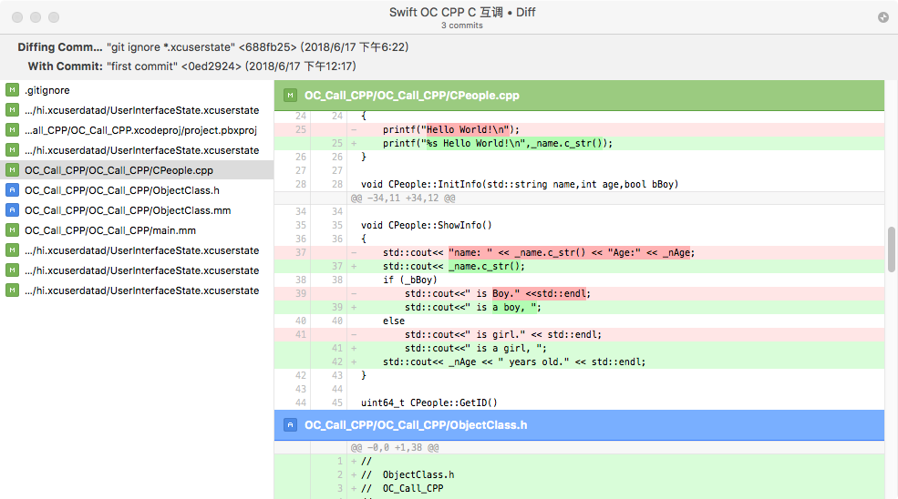

Build GipUp for mac

基于libgit2的Mac 版本的Git图形客户端，已经配置为完整工程，

直接git clone完毕，就可以直接编译运行。

ENGLISH INFO : [README.md](./README 2.md)

Fork Verion: 

[GitUp 1.0.11 20180301](https://github.com/git-up/GitUp/releases)

[libgit2 20180204](https://github.com/git-up/libgit2)

[XLFacility 1.5.11](https://github.com/swisspol/XLFacility)


### 环境:

Xcode 8.3.2

如果不是通过  

```
git clone git@github.com:wanttobeno/GitUp_For_Mac.git
```

模式下载的，编译的时候在Xcode设置中删除GitUpKit.xcodeproj - >> Build Phases -- >> Set 'GitSHA1Key' in Info.plist 。


### 启动界面
<p align="center">

</p>


### 文件改动界面  Changes


<p align="center">

</p>


### 文件对比界面 Diff with HEAD 

<p align="center">

</p>


